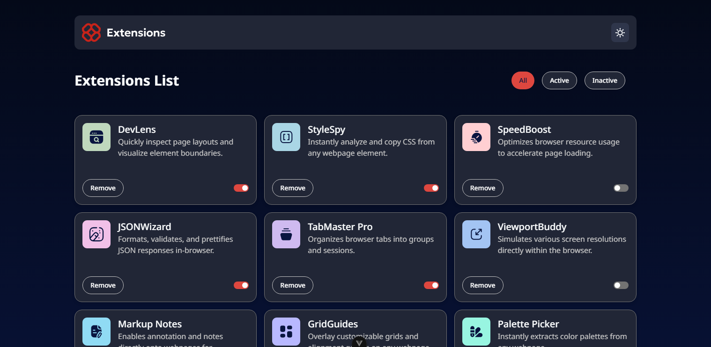

# Frontend Mentor - Browser extensions manager UI solution

This is a solution to the [Browser extensions manager UI challenge on Frontend Mentor](https://www.frontendmentor.io/challenges/browser-extension-manager-ui-yNZnOfsMAp). Frontend Mentor challenges help you improve your coding skills by building realistic projects. 

## Table of contents

- [Overview](#overview)
  - [The challenge](#the-challenge)
  - [Screenshot](#screenshot)
  - [Links](#links)
- [My process](#my-process)
  - [Built with](#built-with)
  - [What I learned](#what-i-learned)
  - [Continued development](#continued-development)
  - [Useful resources](#useful-resources)
- [Author](#author)
- [Acknowledgments](#acknowledgments)

## Overview

### The challenge

Users should be able to:

- Toggle extensions between active and inactive states
- Filter active and inactive extensions
- Remove extensions from the list
- Select their color theme
- View the optimal layout for the interface depending on their device's screen size
- See hover and focus states for all interactive elements on the page

### Screenshot



### Links

- Solution URL: [https://github.com/dylan-dot-c/browser-extensions-ui](https://github.com/dylan-dot-c/browser-extensions-ui)
- Live Site URL: [https://browser-extensions-ui.netlify.app/](https://browser-extensions-ui.netlify.app/)

## My process

### Built with

- Semantic HTML5 markup
- CSS custom properties
- Flexbox
- CSS Grid
- Mobile-first workflow
- [Vue](https://vuejs.org/) - Progressive JavaScript Framework
- [TailwindCSS](https://styled-components.com/) - For styling
- [Pinia](https://pinia.vuejs.org/) - For state management

### What I learned

This was a fun project, came back to vue after a while and while it took some time to remember and re-read some of the docs I was able to get the project done. So i mainly did some relearning.

But what I did learn was that all this time I wasn't coding, TailwindCSS got updated and I was wondering why isn't my config file working and a few other stuff but I dealt with that and saw what happened.

I learnt how to properly manage vue state with Pinia and since you can't destructure props in vue, since it will lose reactivity, you'd have to use it directly in some cases.

I also learnt how to build an accessible switch, so instead of using a label, i actually wrapped the switch design in a button, tied the animation to a state, and used the button(already accessible html element) to control the functionality.

```html
<button 
  @click="toggleActive(extension.name)"
  class="p-0 border-0 focus:outline-1 focus:outline-red-500 w-8 h-4 flex items-center rounded-full transition"
  :class="{'bg-red-500': extension.isActive, 'bg-neutral-200 dark:bg-neutral-500': !extension.isActive}"
  role="switch"
  :aria-checked="extension.isActive">
  <span class="bg-neutral-0 w-3 h-3 rounded-full transition"
    :class="{'translate-x-4.5': extension.isActive, 'translate-x-0.5': !extension.isActive}">
  </span>
</button>
```

had to import the config in the new version
```css
@config "../../tailwind.config.js";
```

```js
const filterOptions = ["all", "active", "inactive"] as filterType[]
  const url = new URL(window.location.href)

  let filter = url.searchParams.get('filter') || "none"
  if(!filterOptions.find((f) => f.toLowerCase() == filter)) {
    filter = "all"
  }

  const state = reactive({
    allExtensions: getStoredData(),
    activeFilter: filter,
    filterOptions: filterOptions,
  });

const changeFilter = (filter: filterType) => {
    const url = new URL(window.location.href)
    url.searchParams.set("filter", filter)
    window.history.pushState({filter}, "", url)
    
    state.activeFilter = filter;
  };
```

### Useful resources

- [Example resource 1](https://www.example.com) - This helped me for XYZ reason. I really liked this pattern and will use it going forward.
- [Example resource 2](https://www.example.com) - This is an amazing article which helped me finally understand XYZ. I'd recommend it to anyone still learning this concept.

**Note: Delete this note and replace the list above with resources that helped you during the challenge. These could come in handy for anyone viewing your solution or for yourself when you look back on this project in the future.**

## Author

- Website - [Dylan-Dot-C](https://guthub.com/dylan-dot-c)
- Frontend Mentor - [@dylandotc](https://www.frontendmentor.io/profile/dylan-dot-c)
